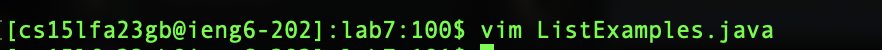
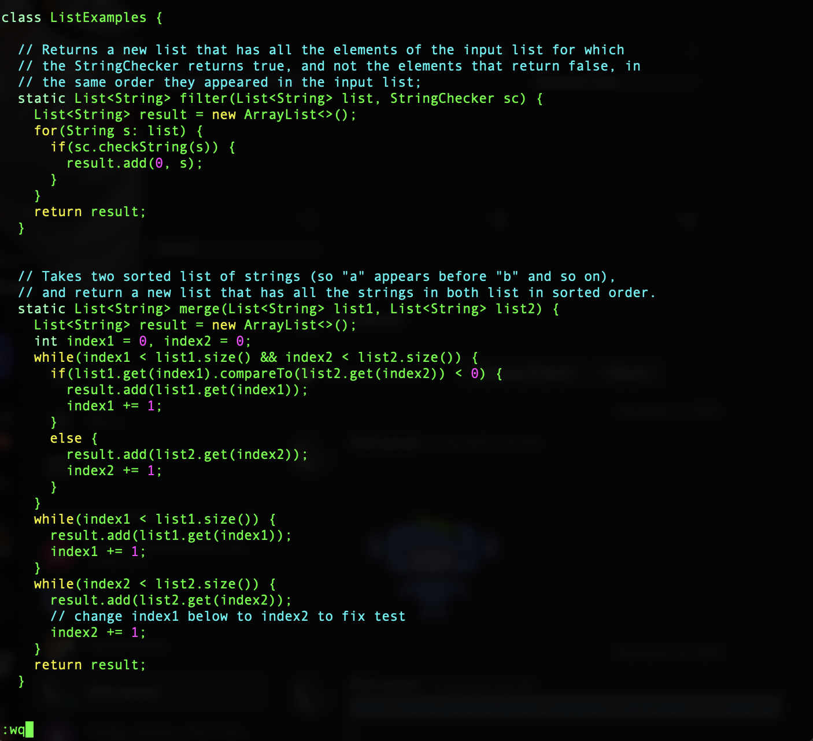

<h1>Lab Report 4</h1>
<h3>Login to ieng6 </h3>
* As I previously loged in my ieng6 account, my terminal has record.
* Therefore I just type `↑` and it would autofill the lien `ssh cs15lfa23gb@ieng6.ucsd.edu` for me.
* Press `<enter>` to log in.

Summarize:

* `ssh` is the command to connect remotely on local computer terminal.
* `↑` fill the previous command to current.

<h3>Clone the repository from the github account (already set up the ssh key)</h3>
* Type `git clone` and paste by typing `ctrl v` the url of the repository from my git hub.
* Press `<enter>` to start cloning.

Summarize:

* `git clone` is a github command that allows people to make a copy of the repository from github.

<h3>Run the tests, demonstrating that they fail</h3>
* Type `cd lab7` to change the directory to lab7.
* Type `bash test.sh` to run the bash script file.

Summarize:

* `cd` is change the current working directory.
* `bash` is the command to run the bash script file.
* 

<h3>Edit the code file to fix the failing test</h3>
* Type `vim` and type ` L`
* After that I press `<TAB>`
* I type `.java` to complete the command

* I press `<enter>` to get into vim editor

* With the cursor on the top left corner, I type `43↓` and type `11→` to set the cursor on the character we need to fix.

* I type `r2` to replace the character we need to replace.

* Type `:wq` to save and exit.

Summarize:

* `vim` is the command to open the vim editor.
* `<tab>'can fill the file name for me.
* `number + arrow` is to move the cursor by number steps to arrow direction.
* `r + character` is to replace the character currently under the cursor to the new character.
* `:wq` to save changes and exit the vim editor.

<h3>Run the tests, demonstrating that they now succeed</h3>
* Click `↑` two times to fill the command with `bash test.sh`
* Press `<enter>`

Summarize:

* `bash` is the command to run the bash script file.
* `↑` fill the previous command to current.

<h3>Commit and push the resulting change to your Github account </h3>
* Type `git add *`.

* Type `git commit -m 'fix error'`.

* Type `git push`.

Summarize:

* `git add *` add all the files that are changed in local repository to the stage.
* `git commit -m 'message'` commit the changes in the stage with message.
* `git push` push the commit to the remote github repository.
